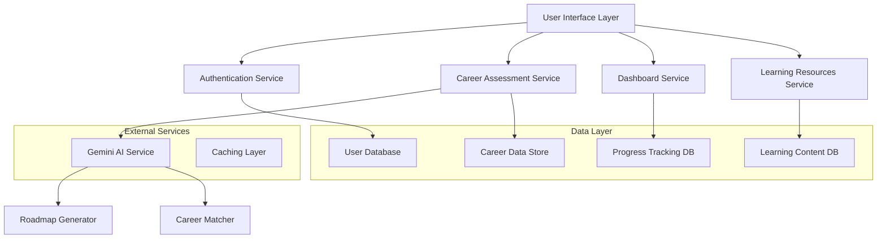
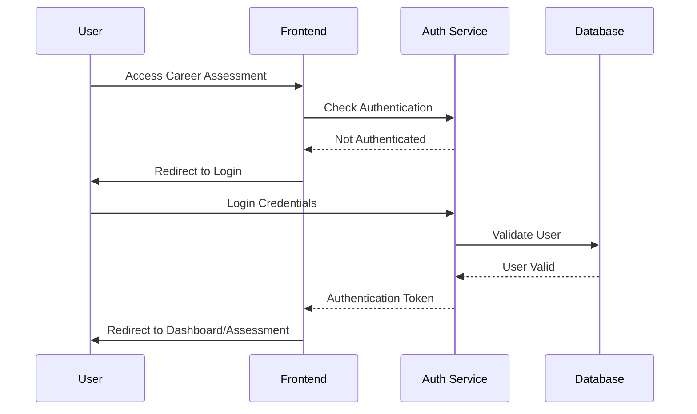
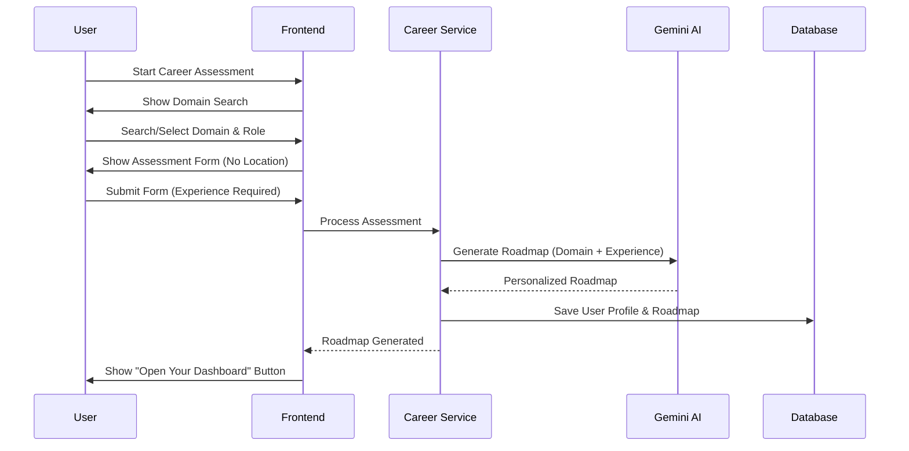

# Design Document

## Overview

The SmartApply AI career platform enhancement transforms the existing career assessment and dashboard system into a comprehensive, AI-powered career guidance platform. The redesign focuses on mandatory authentication, streamlined user experience, Gemini AI integration for personalized roadmaps, and a clean dashboard interface with comprehensive learning resources across 15+ career domains.

The platform will serve as a complete career development ecosystem, guiding users from initial assessment through continuous learning and career progression tracking.

## Architecture

### System Architecture



### Authentication Flow



### Career Assessment Flow



## Components and Interfaces

### 1. Authentication Component

**Purpose**: Mandatory login system with clean logout flow

**Key Features**:

- Redirect unauthenticated users to login
- Simple logout confirmation ("Do you want to log out?")
- Session management and token handling
- Persistent login state

**Interface**:

```typescript
interface AuthService {
  login(credentials: LoginCredentials): Promise<AuthResult>
  logout(): Promise<void>
  isAuthenticated(): boolean
  getCurrentUser(): User | null
  requireAuth(): void // Redirects if not authenticated
}
```

### 2. Career Assessment Component

**Purpose**: Streamlined assessment form with domain search and mandatory experience

**Key Features**:

- Real-time domain and job role search
- Removed location field
- Mandatory experience level validation
- 15+ comprehensive career domains
- Integration with Gemini AI for roadmap generation

**Domain Structure**:

```typescript
interface CareerDomain {
  id: string
  name: string
  subfields: string[]
  careerExamples: string[]
  internships: string[]
  experienceLevels: ExperienceLevel[]
}

interface AssessmentForm {
  fullName: string
  age: number
  educationLevel: string
  domain: string
  jobRole: string
  experienceLevel: ExperienceLevel // MANDATORY
  skills: string[]
}
```

**15+ Career Domains**:

1. Technology & Computer Science
2. Engineering & Manufacturing
3. Science & Research
4. Design & Creative Industries
5. Business & Management
6. Healthcare & Medicine
7. Education & Training
8. Law & Public Policy
9. Arts, Culture & Humanities
10. Social Sciences & Community Services
11. Defense, Security & Law Enforcement
12. Hospitality, Tourism & Aviation
13. Environment, Agriculture & Sustainability
14. Media & Communication
15. Emerging Interdisciplinary Fields

### 3. Gemini AI Integration Component

**Purpose**: Generate personalized career roadmaps and recommendations

**Key Features**:

- Experience-level based roadmap generation
- Domain-specific career guidance
- Quick retrieval through caching
- Optimized API calls

**Configuration**:

```typescript
interface GeminiConfig {
  apiKey: string 
  model: string
  cacheEnabled: boolean
  maxTokens: number
}

interface RoadmapRequest {
  domain: string
  jobRole: string
  experienceLevel: ExperienceLevel
  skills: string[]
  educationLevel: string
}
```

### 4. Dashboard Component

**Purpose**: Clean, organized interface for career management

**Key Features**:

- Personalized career roadmap display
- Learning resources section
- Progress tracking
- Similar job recommendations
- Clean, modern UI design

**Dashboard Layout**:

```typescript
interface DashboardData {
  userProfile: UserProfile
  careerRoadmap: CareerRoadmap
  learningResources: LearningResource[]
  progressTracking: ProgressData
  similarJobs: JobRecommendation[]
  domainInsights: DomainInsight[]
}
```

### 5. Learning Resources Component

**Purpose**: Comprehensive learning materials with progress tracking

**Key Features**:

- Domain-specific learning paths
- Checklist-based progress tracking
- Study guides and preparation materials
- Resource categorization by skill level

**Resource Structure**:

```typescript
interface LearningResource {
  id: string
  title: string
  type: 'course' | 'article' | 'video' | 'practice' | 'certification'
  domain: string
  skillLevel: 'beginner' | 'intermediate' | 'advanced'
  estimatedTime: number
  prerequisites: string[]
  completed: boolean
  progress: number
}
```

## Data Models

### User Profile Model

```typescript
interface UserProfile {
  id: string
  fullName: string
  age: number
  educationLevel: string
  selectedDomain: string
  selectedJobRole: string
  experienceLevel: ExperienceLevel
  skills: string[]
  assessmentDate: Date
  lastLoginDate: Date
}
```

### Career Roadmap Model

```typescript
interface CareerRoadmap {
  id: string
  userId: string
  domain: string
  jobRole: string
  experienceLevel: ExperienceLevel
  milestones: Milestone[]
  learningPath: LearningPath[]
  timelineMonths: number
  generatedBy: 'gemini-ai'
  createdAt: Date
  updatedAt: Date
}

interface Milestone {
  title: string
  description: string
  skills: string[]
  timeframe: string
  resources: string[]
  completed: boolean
}
```

### Progress Tracking Model

```typescript
interface ProgressData {
  userId: string
  completedResources: string[]
  skillsAcquired: string[]
  milestonesReached: string[]
  totalProgressPercentage: number
  lastUpdated: Date
}
```

## Error Handling

### Authentication Errors

- Invalid credentials: Clear error message with retry option
- Session expired: Automatic redirect to login with context preservation
- Network errors: Offline mode with cached data where possible

### Assessment Errors

- Missing required fields: Inline validation with clear messaging
- API failures: Graceful degradation with cached recommendations
- Invalid domain selection: Guided correction with suggestions

### Gemini AI Errors

- API rate limits: Implement exponential backoff and caching
- Generation failures: Fallback to template-based roadmaps
- Network timeouts: Show progress indicators and retry mechanisms

### Dashboard Errors

- Data loading failures: Progressive loading with error boundaries
- Resource unavailability: Alternative content suggestions
- Progress sync issues: Local storage backup with sync retry

## Testing Strategy

### Unit Testing

- Authentication service methods
- Form validation logic
- Gemini AI integration functions
- Progress tracking calculations
- Domain search and filtering

### Integration Testing

- End-to-end authentication flow
- Career assessment to roadmap generation
- Dashboard data loading and display
- Learning resource progress tracking
- Cross-component data flow

### Performance Testing

- Gemini AI response times with caching
- Dashboard loading performance
- Search functionality responsiveness
- Large dataset handling (15+ domains)
- Concurrent user scenarios

### User Experience Testing

- Mobile responsiveness across all components
- Accessibility compliance (WCAG 2.1)
- Cross-browser compatibility
- Loading state management
- Error message clarity and helpfulness

## UI/UX Design Specifications

### Design Principles

- Clean, modern interface with minimal clutter
- Consistent color scheme and typography
- Intuitive navigation and user flow
- Mobile-first responsive design
- Accessibility-focused implementation

### Dashboard Layout

```
┌─────────────────────────────────────────────────────────┐
│ Header: SmartApply AI | User Profile | Logout          │
├─────────────────────────────────────────────────────────┤
│ Welcome Message & Current Career Focus                  │
├─────────────────────────────────────────────────────────┤
│ ┌─────────────────┐ ┌─────────────────┐ ┌─────────────┐ │
│ │ Career Roadmap  │ │ Learning        │ │ Progress    │ │
│ │ - Milestones    │ │ Resources       │ │ Tracking    │ │
│ │ - Next Steps    │ │ - Courses       │ │ - Completed │ │
│ │ - Timeline      │ │ - Articles      │ │ - Skills    │ │
│ └─────────────────┘ └─────────────────┘ └─────────────┘ │
├─────────────────────────────────────────────────────────┤
│ ┌─────────────────┐ ┌─────────────────┐                 │
│ │ Similar Jobs    │ │ Domain Insights │                 │
│ │ - Related Roles │ │ - Industry      │                 │
│ │ - Internships   │ │ - Trends        │                 │
│ └─────────────────┘ └─────────────────┘                 │
└─────────────────────────────────────────────────────────┘
```

### Color Scheme

- Primary: Professional blue (#2563eb)
- Secondary: Success green (#10b981)
- Accent: Purple (#8b5cf6)
- Background: Clean white (#ffffff)
- Text: Dark gray (#374151)
- Borders: Light gray (#e5e7eb)

### Typography

- Headers: Inter, bold, responsive sizing
- Body text: Inter, regular, 16px base
- Buttons: Inter, medium, 14px
- Labels: Inter, medium, 12px

## Performance Optimization

### Caching Strategy

- Gemini AI responses cached for 24 hours
- User progress data cached locally
- Domain and job role data cached indefinitely
- Learning resources cached with version control

### API Optimization

- Batch requests for multiple resources
- Pagination for large datasets
- Compression for API responses
- CDN for static learning content

### Frontend Optimization

- Lazy loading for dashboard components
- Virtual scrolling for large lists
- Image optimization and lazy loading
- Bundle splitting for faster initial load
