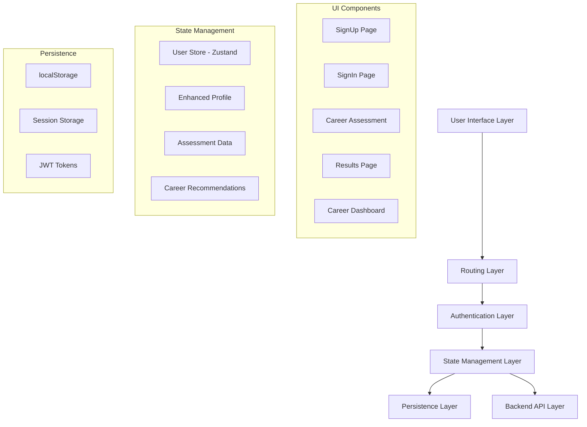
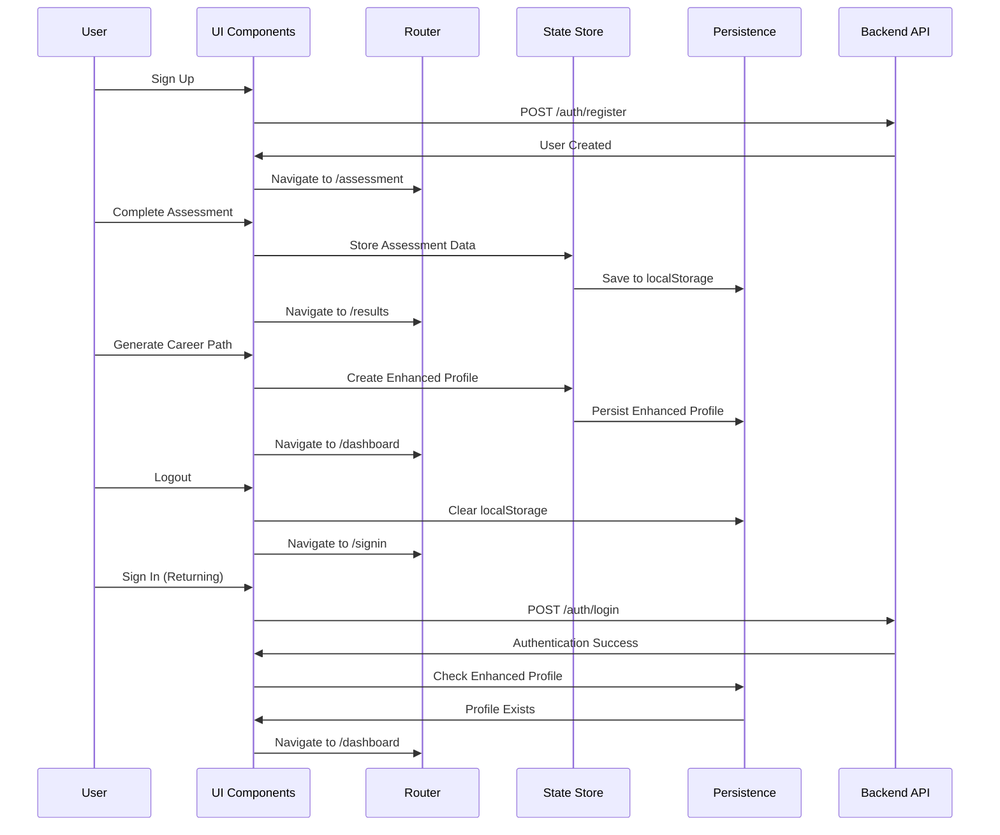

# Design Document

## Overview

The User Authentication and Career Assessment Flow is a comprehensive system that manages user registration, authentication, career assessment completion, profile persistence, and dashboard navigation. The system leverages React Router for navigation, Zustand for state management, and localStorage for data persistence. The design ensures seamless user experience from initial signup through returning user sessions.

## Architecture

### High-Level Architecture



### Data Flow Architecture



## Components and Interfaces

### Authentication Components

#### SignUp Component
- **Purpose**: Handle new user registration
- **Key Features**:
  - Username/password validation
  - Form submission to `/auth/register` endpoint
  - Automatic redirect to `/assessment` on success
  - Error handling for registration failures

#### SignIn Component
- **Purpose**: Handle user authentication and routing logic
- **Key Features**:
  - Username/password authentication
  - Enhanced profile detection for returning users
  - Conditional routing (assessment vs dashboard)
  - Session management

#### ProtectedRoute Component
- **Purpose**: Route protection based on authentication status
- **Current Implementation**: Token-based protection
- **Enhancement Needed**: Enhanced profile awareness for routing decisions

### Assessment Flow Components

#### CareerAssessment Component
- **Purpose**: Collect user career preferences and skills
- **Key Features**:
  - Career path selection (Technology → Data Science)
  - Form fields for age, skills, career interests
  - Pre-population of career interest from path selection
  - Assessment data validation and submission

#### Results Component
- **Purpose**: Display assessment results and create enhanced profile
- **Key Features**:
  - Enhanced profile creation with console logging
  - Career recommendations display
  - "Go to Dashboard" navigation button
  - Profile persistence to localStorage

#### CareerDashboard Component
- **Purpose**: Display personalized career recommendations and user progress
- **Key Features**:
  - Enhanced profile-based recommendations
  - Career path visualization
  - Progress tracking integration
  - Persistent user experience

### State Management Interface

#### UserStore (Zustand)
```typescript
interface UserStore {
  // Core profile data
  profile: UserProfile | null
  enhancedProfile: EnhancedUserProfile | null
  results: CareerRecommendation | null
  
  // Actions
  setProfile: (profile: UserProfile) => void
  setEnhancedProfile: (profile: EnhancedUserProfile) => void
  setResults: (results: CareerRecommendation) => void
  clearData: () => void
}
```

#### Enhanced Profile Structure
```typescript
interface EnhancedUserProfile {
  id: string
  basicProfile: UserProfile
  careerAssessment: AssessmentData
  careerRecommendations: CareerRecommendation[]
  createdAt: Date
  updatedAt: Date
  // ... additional gamification and progress fields
}
```

## Data Models

### User Authentication Data
```typescript
interface AuthenticationData {
  username: string
  password: string
  token?: string
  user?: UserData
}

interface UserData {
  id: string
  username: string
  accessLevel: string
  createdAt: Date
}
```

### Assessment Data Model
```typescript
interface AssessmentData {
  age: number
  skills: string[]
  careerInterest: string
  selectedCareerPath: {
    category: string // e.g., "Technology"
    subcategory: string // e.g., "Data Science"
  }
  completedAt: Date
}
```

### Career Recommendation Model
```typescript
interface CareerRecommendation {
  id: string
  title: string
  description: string
  matchScore: number
  requiredSkills: string[]
  recommendedActions: string[]
  learningPath: LearningPathItem[]
}
```

## Error Handling

### Authentication Errors
- **Invalid Credentials**: Display user-friendly error messages
- **Network Failures**: Retry mechanism with exponential backoff
- **Token Expiration**: Automatic logout and redirect to signin

### Assessment Flow Errors
- **Form Validation**: Real-time validation with clear error messages
- **Data Persistence Failures**: Fallback to session storage, user notification
- **API Failures**: Graceful degradation with offline capability

### State Management Errors
- **localStorage Corruption**: Data validation and recovery mechanisms
- **State Synchronization**: Conflict resolution between localStorage and memory state
- **Profile Migration**: Version compatibility for enhanced profile structure

## Testing Strategy

### Unit Testing
- **Authentication Functions**: Token validation, user data parsing
- **State Management**: Store actions, data persistence, state transitions
- **Form Validation**: Assessment form validation logic
- **Routing Logic**: Conditional navigation based on user state

### Integration Testing
- **Authentication Flow**: Complete signup → assessment → dashboard flow
- **State Persistence**: localStorage integration with state management
- **API Integration**: Backend authentication and data submission
- **Cross-Component Communication**: State sharing between components

### End-to-End Testing
- **Complete User Journey**: New user signup through dashboard access
- **Returning User Flow**: Login → automatic dashboard redirect
- **Data Persistence**: Profile data survival across browser sessions
- **Error Recovery**: System behavior during various failure scenarios

### Console Logging Strategy
- **Enhanced Profile Creation**: Detailed logging for debugging
- **State Transitions**: Log all major state changes
- **Persistence Operations**: Log localStorage read/write operations
- **Navigation Events**: Log routing decisions and redirects

## Implementation Considerations

### Performance Optimizations
- **Lazy Loading**: Route-based code splitting
- **State Optimization**: Selective re-renders with Zustand selectors
- **Data Caching**: Intelligent localStorage caching strategy
- **Bundle Optimization**: Tree shaking for unused dependencies

### Security Considerations
- **Token Management**: Secure JWT storage and validation
- **Data Sanitization**: Input validation and XSS prevention
- **Session Security**: Proper logout and session cleanup
- **API Security**: Request authentication and rate limiting

### Accessibility Features
- **Keyboard Navigation**: Full keyboard accessibility for all forms
- **Screen Reader Support**: Proper ARIA labels and semantic HTML
- **Visual Indicators**: Clear feedback for form states and errors
- **Responsive Design**: Mobile-first responsive implementation

### Browser Compatibility
- **localStorage Support**: Fallback for browsers without localStorage
- **Modern JavaScript**: Polyfills for older browser support
- **CSS Grid/Flexbox**: Progressive enhancement for layout
- **API Compatibility**: Fetch API with XMLHttpRequest fallback